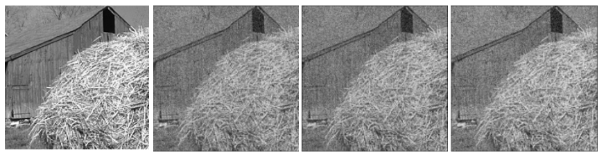
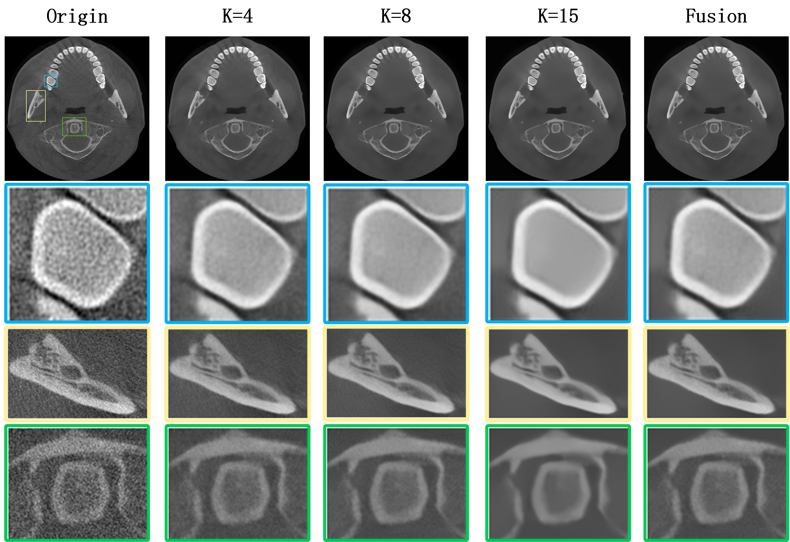
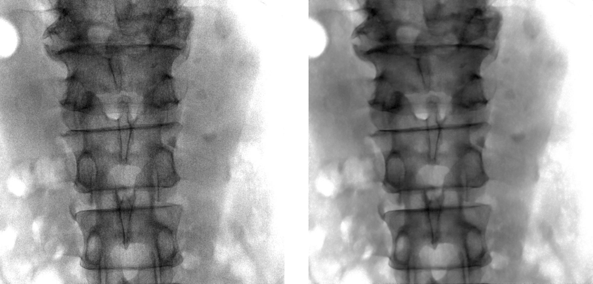
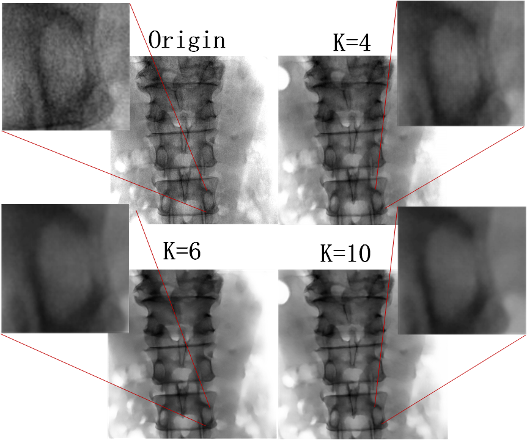
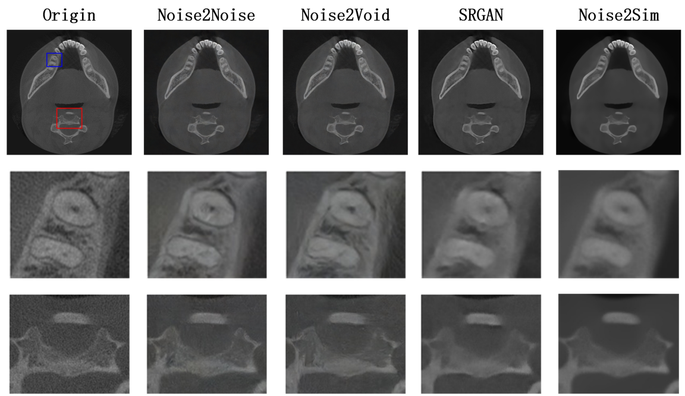
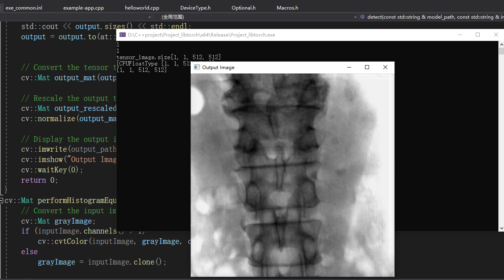

github 记录noise2sim

### 介绍

Noise2sim是一种无监督学习算法，受Noise2noise的启发，在无监督学习的基础上引入相似性，Noise2sim关键思想是用相似的目标替代干净的图像或配对的噪声。具体来说，给定输入的噪声图像，先构造一组相似的子图像$\hat{x_i}$，表示为 $ x_i=s_i+n_i $和 $ \hat{x_i}=s_i+\delta_i+\hat{n_i} $，其中$\delta_i$表示为相似子图像中干净图像组件之间的差异,设$θc$为用配对无噪声数据优化的网络参数：$\theta_c=\underset{\theta}{\arg\min}\frac{1}{N_c}\underset{i=0}{\overset{N_c}{\sum}}||f(s_i+n_i;\theta)-(s_i+\delta_i+\hat{n_i}) ||^2_2$  ，其中$N_s$表示相似图像对的个数。

与现有的深度学习去噪方法相比，Noise2sim在整个图像域中全局搜索并构建相似的子图像，并且方法部分中定义的相似性参数$K$允许我们控制去除图像噪声的程度。$k$越大，可以提高相似训练样本的噪声独立性，从而可以更积极地抑制噪声。另一方面，如果$k$太大，可能会损害去噪结果。参数k可以根据具体的下游任务进行调整。

#### 根据$K$值构建相似子图像

Noise2sim算法构建子图像的逻辑为：

（1）直接在原始图像上添加高斯或泊松噪声得到：image_noise

（2）在image_noise上通过K-NN算法来构建相似子图像

```python
if args.config_file is None:
    # 直接在原始图像上添加高斯或泊松噪声（std和lam两个参数分别对应）
	img_noise = noisify(img_norm, noise_type=args.noise_type, std=args.std, lam=args.lam) * 255.
	data_noise.append(img_noise)
    ...
img_noise = data_noise[idx]
# 根据生成的噪声图像，执行最近邻算法（K-NN）构造相似块
img_noise_sim = compute_sim_images(img_noise, patch_size=args.patch_size, num_select=args.num_sim,img_ori=img_noise_norm)
```

从左到右分别为原始图像和通过算法根据不同K值构建的相似子图像（K=4、K=8、K=12）




更详细内容可在 [页面](http://chuangniu.info/projects/noise2im/) 和 [论文](https://arxiv.org/abs/2011.03384)中找到。另外noise2sim的安装参考：https://github.com/niuchuangnn/noise2sim

### 实验

我们首先用作者提供的[预模型](https://drive.google.com/drive/folders/1DKovoPvxq6IWjgo_hfx1NQ0wdqHwB3Gy)进行了测试，之后又在自己的噪声数据集上进行了训练



- Fusion：不同的特征区域采用了不同的去噪参数






我们也和其他的无监督算法做了几组对比效果图：



### 部署

根据实际的需求，需要将Python端的模型移植到C++平台进行测试和使用，所以这里我们选择[Libtorch库](https://pytorch.org/cppdocs/installing.html)来实现模型的跨平台部署

C++环境：opencv，libtorch

#### 1.在Python环境生成模型文件

对应代码：将libtorch_model_save.py放到Noise2sim的根目录下

**函数功能：**

参数model_weight_path：保存模型权重的路径

参数save_path：转换后结果的保存路径

在Python环境中将Noise2Sim模型训练好的权重文件（checkpoint.pth.tar）转为Libtorch格式文件（model.pt）

**部分关键代码：**读入权重文件，并将model设置为eval()状态

```python
# load model from a checkpoint
model_weight = 'checkpoint_final.pth.tar'
checkpoint = torch.load(model_weight)
state_dict = checkpoint['state_dict']

for k in list(state_dict.keys()):
    # Initialize the feature module with encoder_q of moco.
    if k.startswith('module'):
        # remove prefix
        state_dict[k[len('module.'):]] = state_dict[k]
    # delete renamed or unused k
    del state_dict[k]
model.load_state_dict(state_dict)
model.eval()
```

使用libtorch库的trace()方法将模型和权重保存到model.pt

trace()方法相当于先自定义一个网络输入input，让这个input走一遍网络模型并记录保存下来。

需要注意的是trace()方法只能在网络结构中没有if-else的情况下使用（因为它只能记录单分支，if-else的存在让网络结构存在多个分支），所以我在这一步修改了部分网络结构，在不改变整体架构的情况下去掉了其中if-else的模块。这是一个后期需要改进的地方。

```python
input = torch.ones(1, 1, 800, 800)
trace_model = torch.jit.trace(model, input)
trace_model.save('model.pt')
```

#### 2.C++平台执行模型推理

环境配置：OpenCV、Libtorch、Visual Studio 2019(C++语言标准 14)以上

**detect(model_path, image_path, output_path)**

**函数功能:**

参数model_path：模型的路径

参数image_path：待处理图片的路径

参数output_path：经过模型推理后保存图片的路径。

**部分关键代码：**在C++平台中使用模型进行推理

```C++
// OpenCV读入目标图像
cv::Mat image = cv::imread(image_path, cv::IMREAD_GRAYSCALE);

// 裁剪图像并归一化
cv::resize(image, image, cv::Size(800, 800));
cv::Mat normalized_image;
cv::normalize(image, normalized_image, 0, 255, cv::NORM_MINMAX, CV_32F);

// 将归一化后的图像转为tensor
torch::Tensor tensor_image = torch::from_blob(normalized_image.data, { 1, 1, 800, 800}, torch::kFloat);

// 创建网络输入
std::vector<torch::jit::IValue> inputs;
inputs.push_back(tensor_image);

// 网络推理
torch::Tensor output = module.forward(inputs).toTensor();

// 将推理结果（tensor）转为Mat
cv::Mat output_mat(output.size(2), output.size(3), CV_32F, output.data_ptr<float>());

// 还原图像并保存到路径
cv::Mat output_rescaled;
cv::normalize(output_mat, output_rescaled, 0, 255, cv::NORM_MINMAX, CV_8U);
cv::imwrite('output_path', output_rescaled);
```



### 记录一些坑

- 如果按照Noise2sim官方给的测试语句和文件进行推理，如果你的输入格式没有完全匹配（比如图像格式为.bmp，或者传入的Tensor格式不是(3, , )）电脑都会直接崩溃，具体原因尚未发现。解决方式，重新写了个测试代码。
- 安装Noise2sim的时候需要导入faiss_gpu库，需要Python版本大于等于3.9才可以安装成功，不然一直报错
- Libtorch库对C++的版本要求也比较高，在2014以下的版本无法运行
- 使用Trace()方法保存模型的时候，需要保证模型中没有if-else（trace只能记录单分支），待改进的地方：使用Script方法处理分支结构。
- save之前需要加载模型参数，并model.eavl()
